# Proyecto II – Cruces Inteligentes con Edge AI Embebido

---

## Descripción General

Este proyecto implementa un nodo de visión computacional embebido capaz de detectar y clasificar vehículos y fauna en tiempo real directamente en el borde. El sistema se ejecuta sobre una **Raspberry Pi 4** con una imagen Linux personalizada generada mediante **Yocto Project**, optimizada para inferencia local con **TensorFlow Lite** y preprocesamiento de video con **OpenCV** y **Imageio**.

**Objetivo:** realizar análisis continuo de video sin depender de la nube, con baja latencia y utilizando solo los recursos estrictamente necesarios.

---

## Arquitectura del Sistema

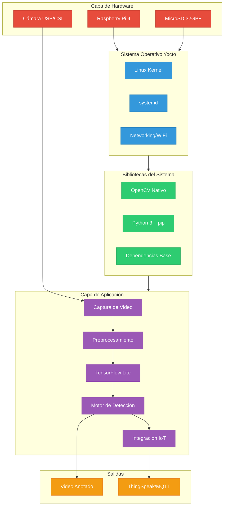

---

## Pipeline de Procesamiento

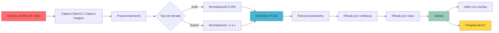

---

## Fundamentos del Sistema

### 1. Procesamiento de Video con OpenCV

La imagen generada con Yocto integra OpenCV de forma nativa. Este componente se encarga de:

- Captura eficiente de video desde una cámara USB/CSI
- Preprocesamiento: redimensión, normalización y corrección de color
- Entrega de frames listos para inferencia sin overhead gráfico

OpenCV es la primera etapa del pipeline y determina el rendimiento global del sistema.

### 2. Inferencia Ligera con TensorFlow Lite

La Raspberry Pi ejecuta modelos optimizados (por ejemplo, MobileNet o EfficientDet Lite) usando TensorFlow Lite instalado vía pip, lo que evita recompilar TensorFlow desde Yocto.

**Flujo de inferencia:**

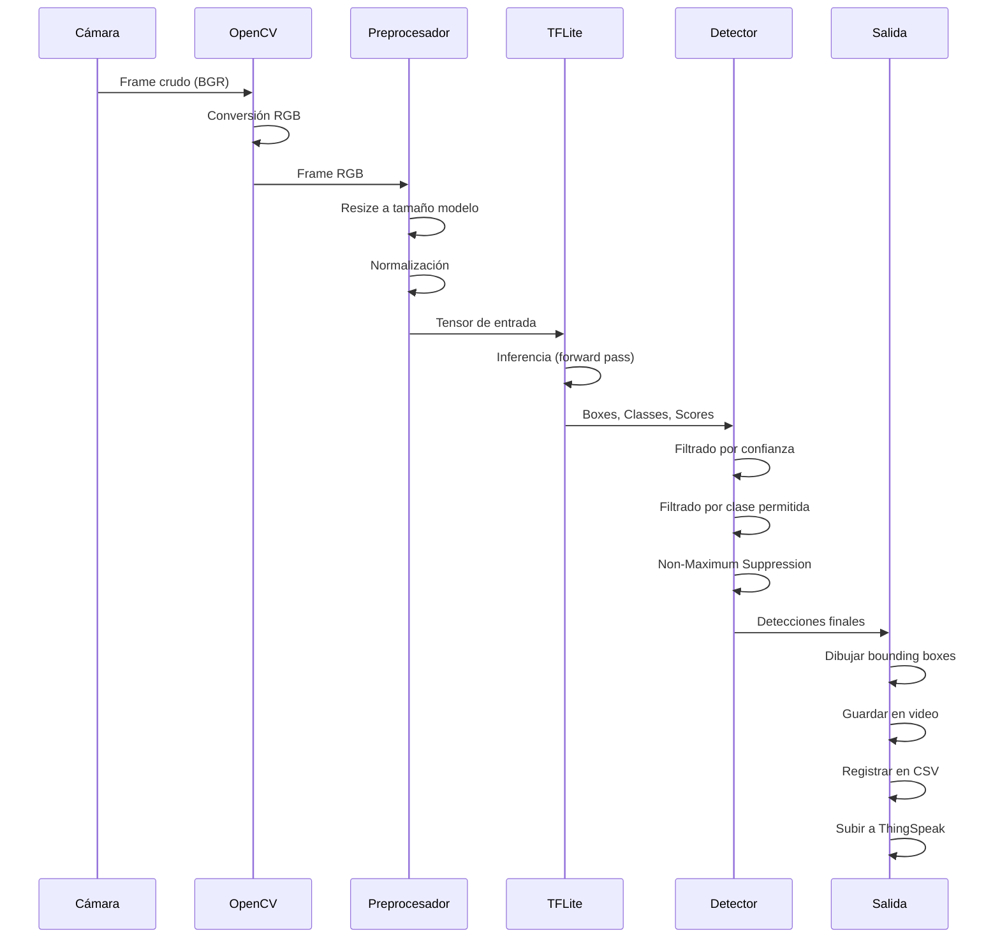

### 3. Sistema Operativo Mínimo con Yocto

La imagen Yocto está diseñada para incluir solo lo necesario:

**Componentes nativos compilados:**
- OpenCV 4.x con optimizaciones ARM
- Python 3.x + pip + setuptools
- Soporte completo para cámara USB (V4L2)
- GStreamer para procesamiento multimedia
- Servicios administrados mediante systemd
- WiFi y Bluetooth (firmware bcm43430/43455)
- wpa_supplicant para redes
- GPIO y buses I2C

**Dependencias instaladas vía pip:**
- TensorFlow Lite runtime
- NumPy
- PyYAML
- imageio + ffmpeg

---

## Capas de Yocto Utilizadas

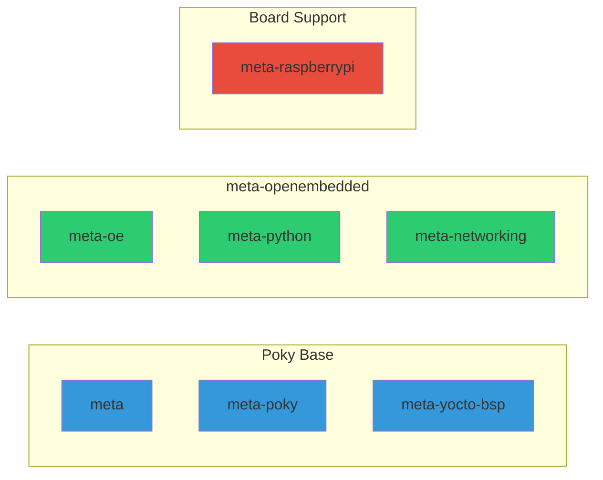

---

## Requisitos de Hardware

| Componente | Especificación |
|-----------|---------------|
| **Placa** | Raspberry Pi 4 (4 GB RAM recomendado) |
| **Cámara** | Cámara USB o CSI compatible |
| **Almacenamiento** | MicroSD 32 GB o más |
| **Alimentación** | Fuente 5 V / 3 A estable |
| **Conectividad** | WiFi (incluida en la imagen) |

---

## Flujo de Detección y Filtrado

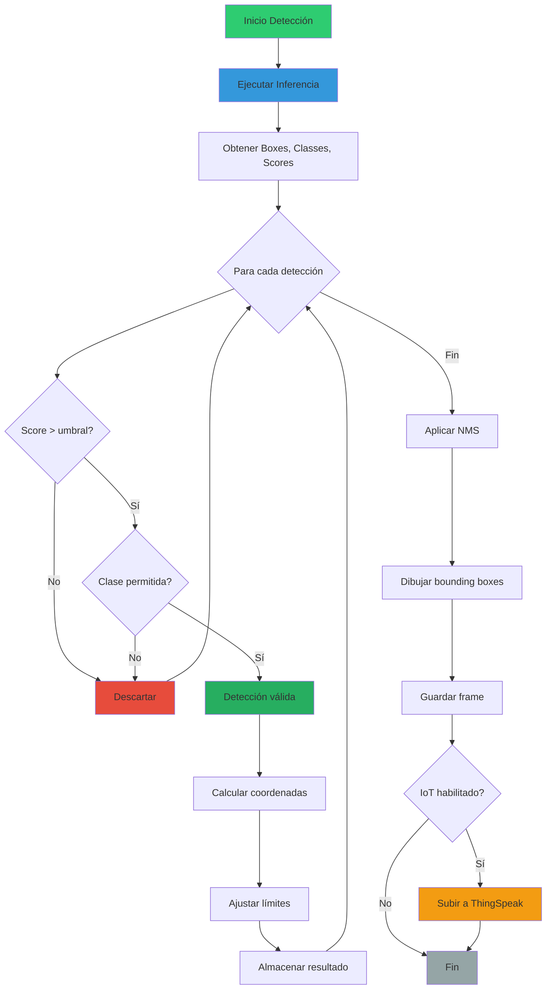

---

## Clases Detectables

El sistema filtra detecciones basándose en clases relevantes para entornos urbanos:

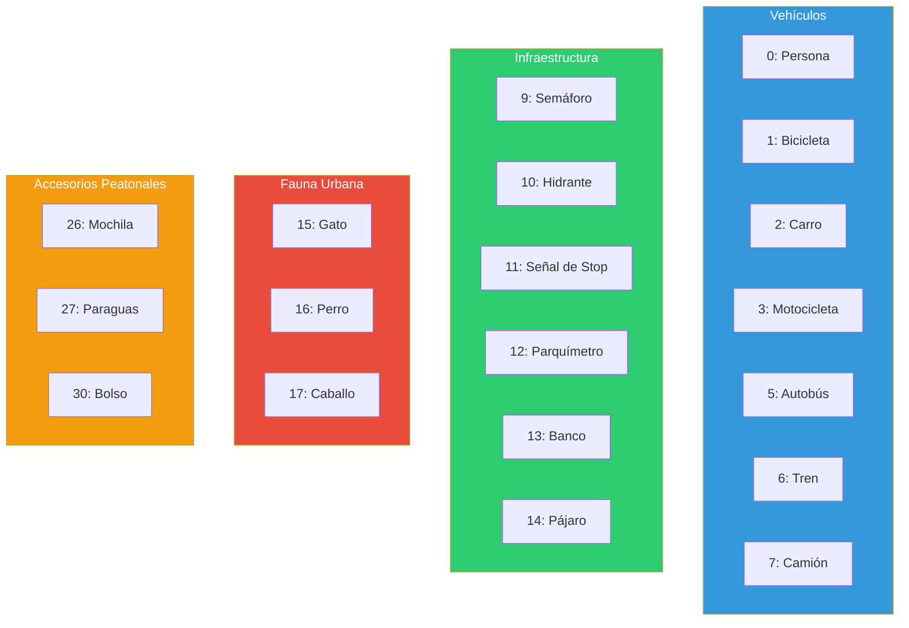
---

## Thingspeak

La plataforma ThingSpeak recibe en tiempo real los datos enviados por el sistema embebido. Cada detección procesada por el modelo se publica como un valor numérico que luego se visualiza en forma de gráficos históricos. Esto permite verificar que la comunicación IoT funciona correctamente, monitorear el comportamiento del sistema a lo largo del tiempo y validar que las detecciones generadas en el dispositivo llegan de forma confiable a la nube.

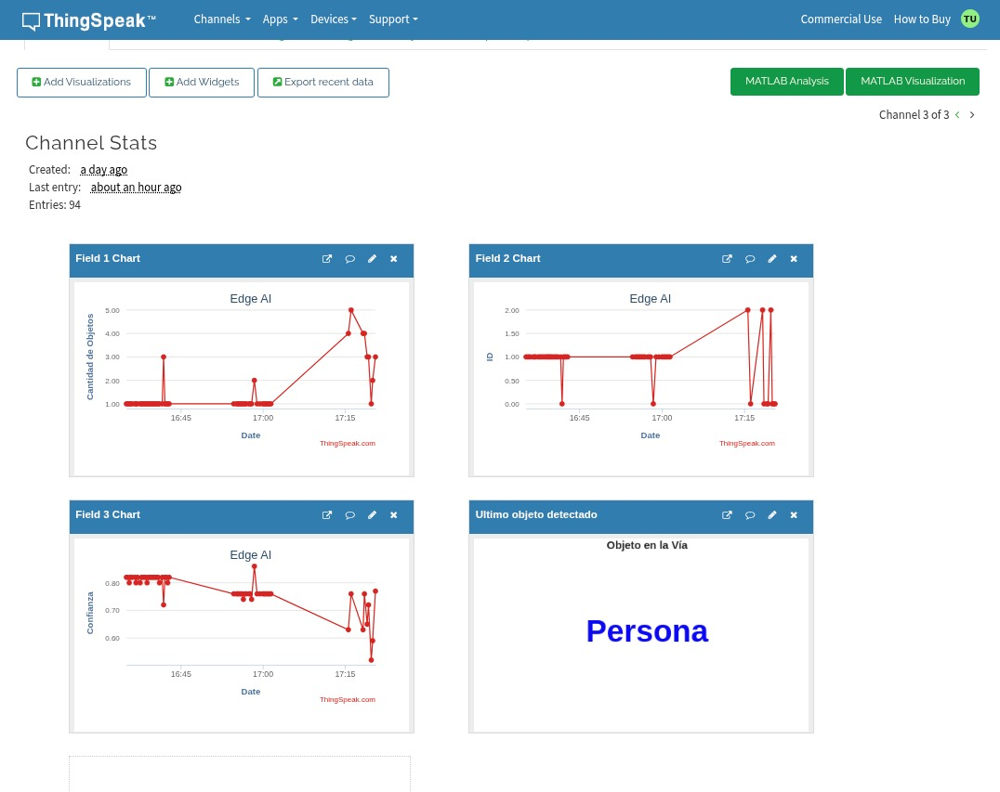

## Posibles casos de uso

### 1. Monitoreo de Tráfico Urbano

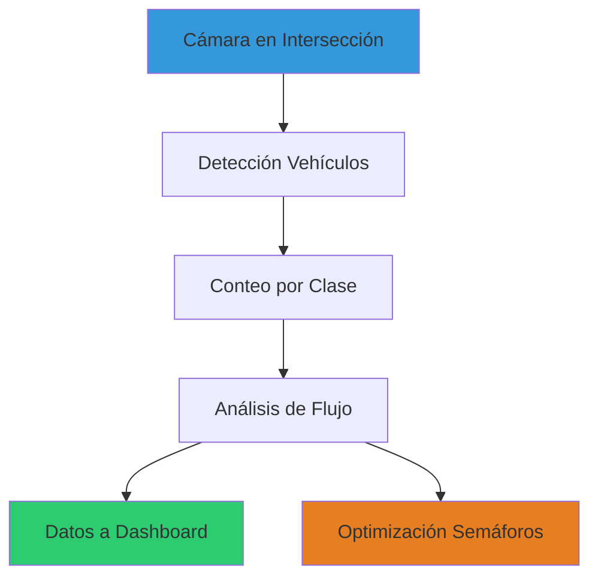

### 2. Detección de Fauna en Cruces

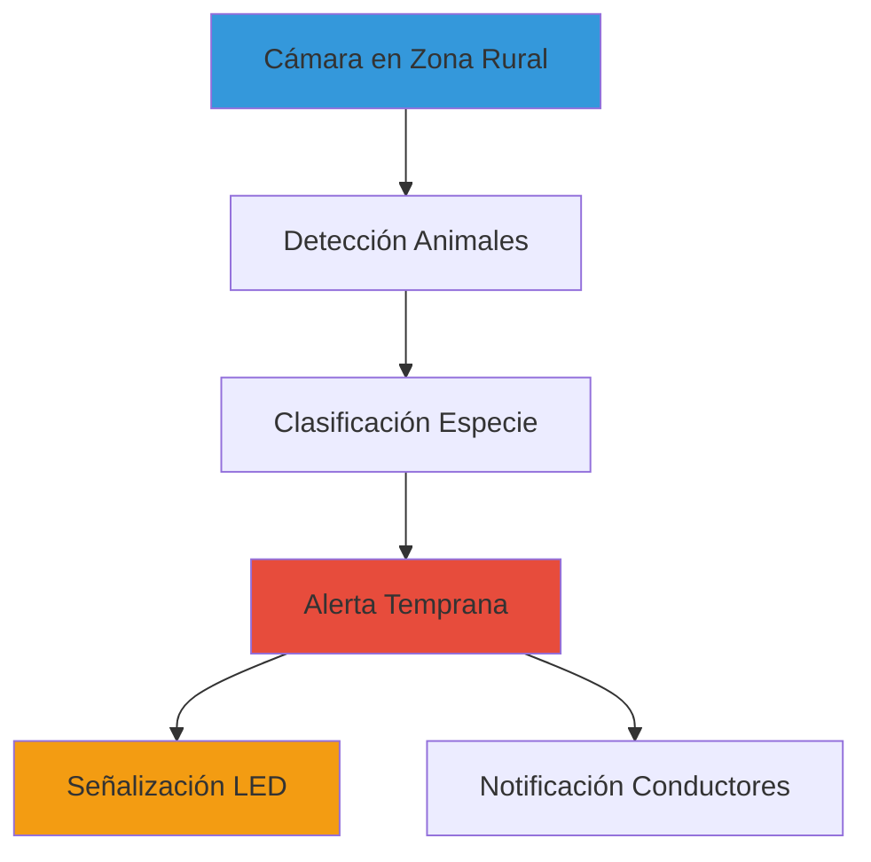

### 3. Análisis de Seguridad Peatonal

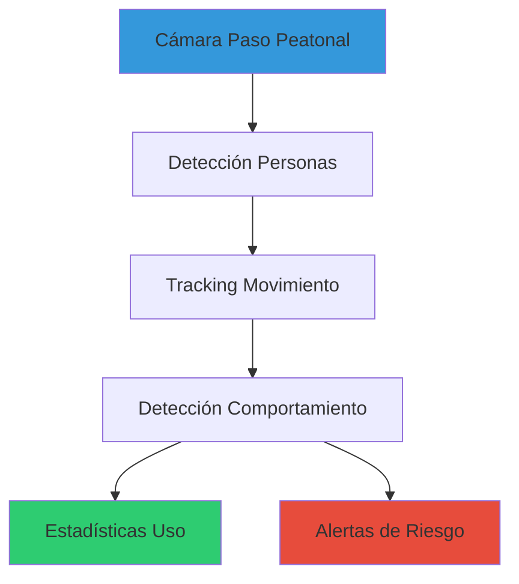

---

## Mejoras Futuras

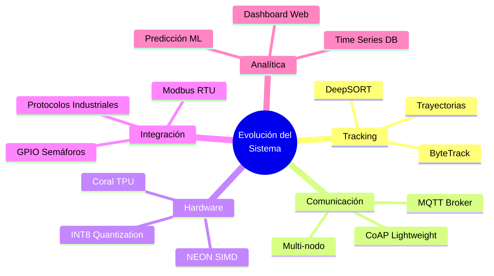

---

